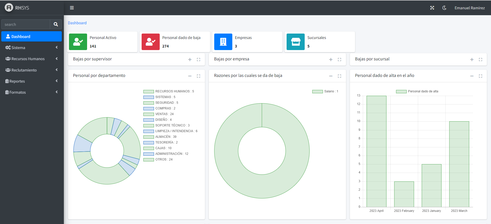

# RHSYS 💻
Sistema para llevar el registro del personal, requisiciones, agendar entrevistas, candidatos y seguimiento de entrevista.

# Indice 
1. [Screenshots](#Screenshots)  
2. [Modulos](#Modulos)  
3. [Instalación](#Instalación)  
4. [Stack](#Stack)
5. [Author](#Author)

## Screenshots  
  
 
# Modulos
1. Dashboard
2. Sistema
    1. Generales
        1. Empresas
        2. Sucursales 
        3. Puestos
        4. Departamentos
    2. Accesos
        1. Usuarios
        2. Roles
3. Recursos Humanos
    1. Personal
    2. Vacantes Autoizadas
4. Reclutamiento
    1. Requisiciones
    2. Candidatos
    3. Entrevistas
5. Reportes
    1. Censo
    2.Entrevistas
6. Formatos
    1. Asistencias

## Instalación  

Clone the project  

~~~bash  
  git clone git@github.com:emanuel-ra/rhsys.git
~~~

Go to the project directory  

~~~bash  
  cd rhsys
~~~

Install dependencies  

~~~bash  
npm install
composer install
~~~

Start the server  

~~~bash  
php artisan serve
~~~  

## Stack
- PHP 7
- [Laravel 8](https://laravel.com/docs/8.x) - PHP Framework
- [AdminLTE](https://adminlte.io/docs/3.0/implementations.html) - Template
- [Bootstrap](https://getbootstrap.com/docs/5.1/getting-started/introduction/) - CSS Framework

## Author 
- Github - [emanuel-ra](https://github.com/emanuel-ra/)
- Frontend Mentor - [@emanuel-ra](https://www.frontendmentor.io/profile/emanuel-ra)
- Linkedin - [@emanuelramirezabarca](https://www.linkedin.com/in/emanuelramirezabarca/) 
 